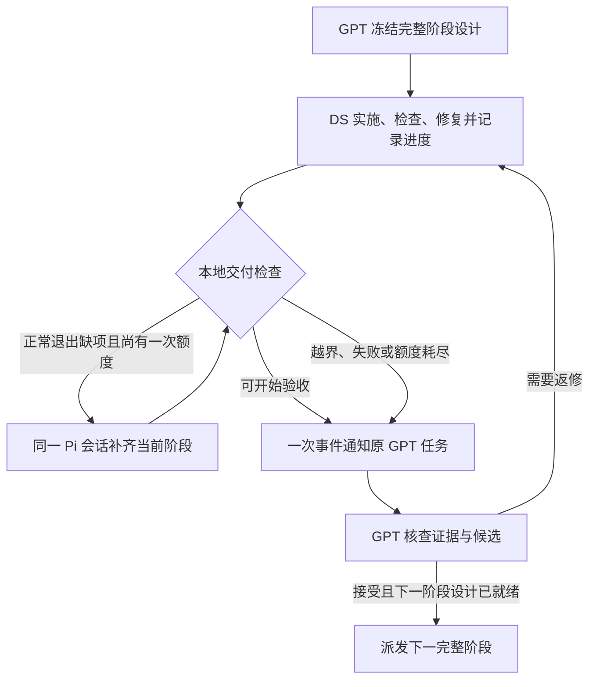

# Codex–Pi 事件看板

2026-09-26：看板与 CLI queue 实现已通过主会话独立验收，源码候选 `7fec7b5f0fb032a3054bbfe468e915528006a03b`。正式操作以 [协作规则](../skills/collaborate/SKILL.md) 和 [交接命令](../skills/collaborate/references/handoff.md) 为准。

## 看板表达什么

每个任务保留目标、所属桌面任务 UUID、Pi 轮次及阶段、候选提交、当前命令与时限、检查和原始证据引用、待处理事件、主会话决定。执行状态、投递状态、验收决定分别保存：读取不等于处理，已投递不等于已验收。

普通进行中状态只更新本地数据。完成、超时、已确认的资源超限或需处理的故障生成有身份的事件；事件含简短摘要、需要主会话作出的决定和准确证据引用。长日志与历史留在磁盘。一个消息装不下时，必须指示主会话在同一轮读取剩余事件。

## 谁检查、何时调用主模型

已有 Pi supervisor 约每 15 秒刷新本地看板，状态未变不调用模型。仅有待处理事件时，以 `codex --disable daemon_auto_start queue --thread UUID --message TEXT` 通知原桌面任务。此 CLI 是消息传输，不调用第二个 Codex 模型，也不新增 MCP、heartbeat 或常驻服务。

桌面任务空闲时可自动续行；忙时等本轮结束。主会话有独立工作就继续工作，没有则结束当前轮次，不用长 Stop hook 或循环 `wait` 占住会话。收到消息后核对事件，终态 `result` 每轮只取一次，阅读相关 diff 与真实回执，验收或续接同一 Pi 会话返修。

## 故障与恢复

- 命令时限与声明目录的容量上限由本地脚本保护；复制保留符号链接，避免材料膨胀。判断必须依据真实命令和证据，不能把 PID 存活当成有效推进。
- 投递有锁、身份与去重。发送后崩溃或结果不明保留 uncertain，不能自动反复重发；显式 rearm 仍可能重复，因为 CLI 没有调用方幂等键。
- 用户中断暂停交接，普通追问不会解除暂停；取消 Pi 是另一个动作。已排队消息也必须服从最新用户指示。
- helper 只在已知终态、无运行进程持锁时事务升级，并验证原会话与工作树不变。
- supervisor 自身被杀死不能自行上报；下一次正常交互检查恢复。忙碌主会话也会延后回复，因此不承诺所有故障两三分钟内可见。

## 费用与验收

脚本读看板不消耗主模型 token；每次真正续行仍携带原任务上下文。节省来自消除空轮询、限制事件内容和重复取证，不声称未经同口径测量的固定降幅。历史 heartbeat 六次调度的重复输入证据保存在 原始记录 (private raw evidence; omitted from public repository)，该试验自动化 `pi-harness` 已于 2026-09-26 删除。

代码与竞态复测见 [验证记录](validation/cli-queue-20260926.md)；真实 Pi 小任务的完整通知与回复链见 [快速验收](validation/quick-pi-acceptance-20260926.md)。旧 gate 试验没有成为发布机制。

## 下一轮目标与技术路径（设计草案，尚未实施）

2026-09-26：以下记录用户确认的协作目标和本轮讨论结果；不改变当前 0.4 的运行规则，不代表下一版已安装或两个业务项目已迁移。实施和验收依据仍须在下一轮执行时绑定实际候选与证据。

### 目标和已经确认的分工

在相同任务范围和验收质量下，尽量减少 GPT 的绝对 token 消耗，把可执行的实施工作交给 DeepSeek。更多 DS 工作是实现这一目标的手段；提高 DS token 占比、增加 DS 空转或缩减验收范围都不算节约。

| 责任方 | 应承担的工作 | 边界 |
| --- | --- | --- |
| GPT 主会话 | 明确总体目标，完成可执行设计、阶段结果与质量标准；处理设计/范围决策；独立验收候选；决定是否进入下一阶段 | 不编写、修补实施代码和测试；验收发现的问题交回 DS |
| Pi / DS | 固定 `deepseek/deepseek-flash`、thinking `max`；实现源码、测试、夹具、脚本、配置和配套文档；运行检查、诊断普通故障、修复、提交、报告进度及准备发布材料 | 不自行降低标准、扩大权限/预算、改变模型或认定验收通过 |
| 本地脚本 | 记录真实执行证据、维护看板、资源与时限保护、去重投递、受限的同阶段续接 | 不调用模型判断设计好坏，不把进程退出或材料齐备当成质量通过 |

GPT 可直接调用已有的初始化、派工、收件、检查、验收决定和插件安装工具；这些工具操作不等于代写实施。设计文档由 GPT 维护；设计之外的实施性文档、测试工具和发布准备也应交给 DS。需要临时验收工具时，优先复用已审查工具或让 DS 先提供工具，GPT 选择独立用例并核查实际结果。

**用户已确认的两项规则：**

1. 每个完整、可独立验收的阶段都由 GPT 验收后再推进。阶段内编码、测试、诊断和返修由 DS 连续完成，不拆成 GPT 检查点。
2. DS 正常退出但交付缺项时，脚本可以在剩余阶段预算内自动续接同一 Pi 会话一次；仍不合格再交 GPT。不能跨阶段，不能越过用户暂停。

继续使用“一套公共工具 + 每个项目少量明确约束”。公共工具只管生命周期、进度、证据和通知；业务真相源、允许范围、检查命令和项目特有风险仍由项目维护，不复制一套公共业务 PLAN。

### 现状与需要补齐的部分

0.4 已验证本地看板、已有 supervisor 的 CLI queue 投递、同一桌面任务自动续行、去重与保守恢复。它还不能证明完整阶段的分工或实际 GPT 节约幅度。

- [`compose_brief`](../runtime/pi_task.py) 目前主要组合文本与项目约束；已有任务设计并非空白，但缺少统一的阶段入口、完成标准和自主修复边界。
- [`project_events`](../runtime/pi_board.py) 当前会对已知终态生成 `review_required`，也会将单次检查超时交主会话处理。只读探针已复现：退出 0、没有检查回执也会请求验收；仍运行中的一次超时也会请求 GPT 决策。这些行为不是自动验收，但可能过早唤醒主模型。
- 看板目前较擅长表达进程状态；还需明确表达阶段结果、验收项覆盖、DS 正在修复什么以及真正需要主会话回答的问题。
- 过去由主会话完成的夹具准备、测试排错和发布整理也消耗 GPT；只把业务源码交给 DS 不足以实现目标。

### 一个阶段、一份可执行约定

阶段是完整结果；`round` 是一次 Pi 进程执行；`step` 是阶段内的工作步骤。一个阶段可以包含多次检查和返修轮次，进程退出不自动结束阶段。阶段内续接复用原任务、Pi session 和工作树。

派工前由 GPT 确认以下内容足以实施，冻结为该阶段 brief 的机器可读头部与设计引用；不另建并行计划库。具体序列化方式在实施前冻结，优先复用已有 brief 和任务元数据。

| 最小内容 | 用途 |
| --- | --- |
| 总体目标、阶段 ID、阶段要交付的完整结果 | 判断阶段是否完整，避免把解析/测试/修复误当独立阶段 |
| 基线、前置条件、允许修改范围、设计引用及 revision/hash | DS 从准确材料开始；修复不得漂移到另一份设计 |
| 接口/不变量、关键失败路径、必要的项目约束 | 足够指导实现，不只给一句功能标题 |
| 带 ID 的验收项、实际检查命令、通过条件、所需证据 | DS 能自检，脚本能列出缺项，GPT 能逐项验收 |
| 阶段总预算、命令时限、资源上限、自主修复与升级条件 | 防止无止境测试和返修；续接不重置总预算 |
| 阶段完成条件及下一阶段引用 | 当前阶段接受前不得推进；下一阶段也须有已授权的可执行设计 |

脚本只检查必需字段、引用一致性和预算是否可执行，不能声称它已验证设计质量。项目已有 PLAN/design 是权威；brief 是本阶段执行快照，设计变更必须明确换版，旧候选不能沿用另一版的验收决定。

本设计全文供按需查阅，不在每轮派工或回音中重复注入。公共规则只保留必要边界；每轮材料限定为当前阶段约定、必要项目引用及新增反馈。短材料减少新增输入，减少不必要的主会话续行才是控制反复输入长历史的主要措施。

### 看板只保存决策所需的小信息

扩展现有 card，不再复制完整设计、日志或一套计划。下面是逻辑字段分组，尚不是已实现的文件格式：

| 信息 | 写入者与可信边界 |
| --- | --- |
| `phase_id / result / contract_ref / contract_hash` | 派工时由主会话确定；看板只留短结果和引用 |
| `round / observed_state / current_command / deadline / last_observed_at` | supervisor 根据进程、锁和检查回执观察；存活不等于有进展 |
| `step / activity / completed_criteria / next / blocker` | DS 的小型进度报告；`activity` 为实施、检查、修复或阻塞；仍是未验证报告 |
| `candidate_head / readiness / coverage_ref / gaps` | 脚本对照约定与真实回执生成；缺项、不通过、未知分别表示 |
| `paused / remaining_budget / recovery_used` | 受控命令维护；DS 的进度报告不得改写暂停、预算和续接次数 |
| `event_id / reason / evidence_refs / decision` | 脚本生成事件，GPT 写验收决定并绑定准确候选和约定版本 |

DS 在有意义的步骤完成、开始长检查、进入修复或发生阻塞时更新进度。提供一个短命令来校验并原子写入，避免依赖自由文本日志解析。无需 DS 按秒报告，也无需 GPT 定时醒来读表；平时由 supervisor 继续约每 15 秒本地检查。普通进展只更新看板，用户主动询问时读取短摘要并回答。

看板读写沿用短锁和有界扫描，不能在主会话工具调用中等待 Pi 完成。没有其他工作时主会话结束当前轮次，保持可对话。

### 交付检查与一次自动补齐

脚本将阶段约定、候选提交和已有 `pi_check` 回执拼成短交付包：结果、变更范围、验收项到证据的索引、缺项或阻塞，以及待 GPT 作出的决定。默认只发送短包和路径，原始失败尝试仍保留在磁盘，验收按需要读取。

先判断自主处理、自动补齐、升级或就绪，再生成通知，不能先排队唤醒 GPT 再尝试撤回。事件身份绑定阶段、约定、候选和需决策的原因；日志追加、时间戳更新和每次普通重试都不应产生新唤醒。已恢复的中间失败保留在证据中，不反复作为待处理故障投递。

`ready_for_review` 至少要求：已知执行终态且无残留写入者；候选可准确定位；约定要求的检查证据存在且适用于候选；没有未解决的必需检查失败或已声明阻塞。候选与检查通过提交或可验证内容身份关联，不能拿旧提交的绿灯覆盖新代码。零测试、skip 等按具体检查约定验证；无法解释的输出记为未知，不能靠通用字符串匹配猜 PASS。满足这些条件只表示可以开始 GPT 验收。

**自动补齐仅适用于正常退出但可机械列出的交付缺项**，如缺少所需检查或准确回执。实施要求如下：

- 在原阶段剩余预算内，向同一 Pi session/worktree 续发约定引用和缺项列表；不重发整个历史，不擅自改变实施目标。
- 每个阶段的一次额度持久保存，普通轮次变化、进程重启、重复通知或 GPT 返修均不能自动重置。新阶段才有新的额度。
- 原子核对阶段/约定/预期轮次、暂停状态、预算、进程归属并认领额度。重复监督器和并发手工 `continue` 不能各启动一个 worker。
- 启动结果不明时标为未知并交回主会话，不能猜测未启动后再发一次。恢复启动与暂停使用同一锁和版本检查；暂停已生效则不启动，启动后到达的暂停仍按现有暂停/取消语义处理。
- 第二次仍缺项、必需检查已有未解决失败、预算超限、非正常终止、所有权不明或设计冲突，都不再自动补齐，保留证据并升级。

DS 运行中的普通测试失败仍由它自主诊断修复；上述“一次”限制的是进程已退出后的脚本补齐，不是阶段内只许修一次。GPT 已验收后提出的真实缺陷走明确 `changes_requested`，由 DS 返修，不能用自动补齐额度冒充已批准的设计变更。

### 快速发现问题，不等于每个问题都唤醒 GPT

| 观察结果 | 下一步 |
| --- | --- |
| 正常进度、进入检查、阶段内普通失败 | 更新本地看板；DS 继续工作，不调用主模型 |
| 已声明命令时限或资源上限被触发，仍在阶段修复权限内 | 包装器停止该命令所拥有的进程并留下回执；DS 据此修复；记录本地事件，不立即请求 GPT |
| 可验收交付、真正的设计/范围问题、阶段预算耗尽或无法安全推进 | 合并为有身份的可处理事件，经已有 queue 通知原主会话 |
| 用户暂停、旧轮事件、已决定事件 | 服从最新指令，抑制陈旧通知；不启动下一阶段 |

每个长命令必须事先有时限和适用的容量保护。目标是已声明、可由本地监测确认的异常在两三分钟内得到检测或停止；为具体风险配置检测周期与阈值，不能将所有合法长测试强制限时两分钟。没有新日志或 PID 仍在都不足以判定卡死，不能以固定静默时长制造故障结论。

本地发现后若 DS 正在安全修复，GPT 无需立刻参与；停止修复、超出预算或需要决定时再唤醒。supervisor 自身死亡、应用不可用及主会话忙碌仍有可见性限制。已排队旧消息也不保证可撤回，主会话收到后必须检查阶段/候选/决定是否仍有效；不承诺严格 exactly-once。

### 主会话验收与跨阶段推进

GPT 以准确设计版本、候选 diff、必需检查和真实行为证据作出 `accept`、`changes_requested` 或阻塞判断；脚本不得代写接受。合并返修意见一次交回 DS，避免逐文件指挥。适用的同候选证据应复用，额外检查针对实际风险，不因通知到达就重跑所有历史测试。

只有本阶段已经接受、最新指令允许继续、下一阶段约定已就绪且无冲突 worker 时，才可派发下一阶段。GPT 的验收决定必须显式连接这个推进动作；DS 不自行跨阶段。这些判断与现有 board `decide` 接口整合，不建立另一个验收权威。

### 下一轮按完整结果实施

| 阶段 | DS 要交付的完整结果 | GPT 验收依据 |
| --- | --- | --- |
| O1：完整阶段的自主执行闭环 | 阶段约定、结构化进度、交付检查、事件分类、一次同阶段补齐、暂停/预算/跨阶段约束形成一条可运行路径；附测试与操作文档 | 无模型的确定性测试：正常进度不发消息、可自行修复的超时不升级、缺项不误报就绪、一次续接/并发/崩溃/暂停、陈旧回执与候选、未接受不能跨阶段；保留已验证的 queue 恢复边界 |
| O2：真实小任务与成本归因 | DS 提供测试准备材料并执行 [V-02](validation/independent-staged-collaboration-task.md)，提交代码、测试、步骤进度和完整交付；整理两方使用量 | 主会话独立验收功能、分工和实际交接；一个完整阶段里的三个步骤不中途调用 GPT；跨阶段限制另用受控的两阶段夹具验证 |
| O3：发布与项目接入 | DS 准备发行材料和必要的项目适配；主会话验收后通过正式安装工具更新 | 版本/helper hash、终态升级、原 Pi session/worktree 保持；两个业务任务分别取得迁移证明；活跃 worker 不热替换 |

O1 和 O2 的实施代码、测试准备脚本与配置均由 DS 完成。真实任务若一次通过，不人为制造缺陷；需要返修时才实测同会话修复。复用有效的 0.4 忙时/空闲/真实通知证据，除非传输层改变或出现新问题，不重复烧模型验证。

成本记录覆盖从设计、测试准备到接受完整阶段的双方请求与检查；分开记录 GPT 和 DS 的未缓存输入、缓存输入、输出、请求数、耗时，以及主会话每次唤醒原因、重复取证和返修次数。用户主动追问可以单列，但不能从总成本中隐去。沿用成本公式时同时保留原始分量，不能直接将订阅额度换成另一供应商美元。

最低可验证目标：正常受控阶段内 GPT 实施文件编辑为 0，无空轮询唤醒，DS 有完整实施与检查证据，GPT 质量验收不缩水。整阶段 GPT 成本是否下降，须与同范围、同质量的基线比较；没有计数或对照就分别标未知、未测量，不报节约百分比。一次短任务通过不能替代长业务阶段的后续验证。

本轮两项边界决定已确认。以上仍是供讨论的技术路径，本轮只更新设计；不启动 O1，不安装下一版，不向业务任务宣称新规则已生效。
